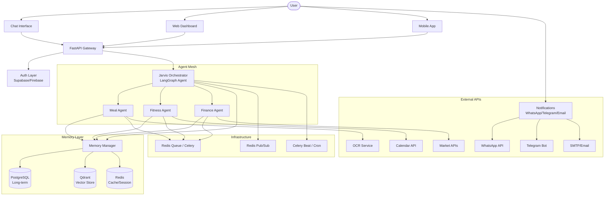
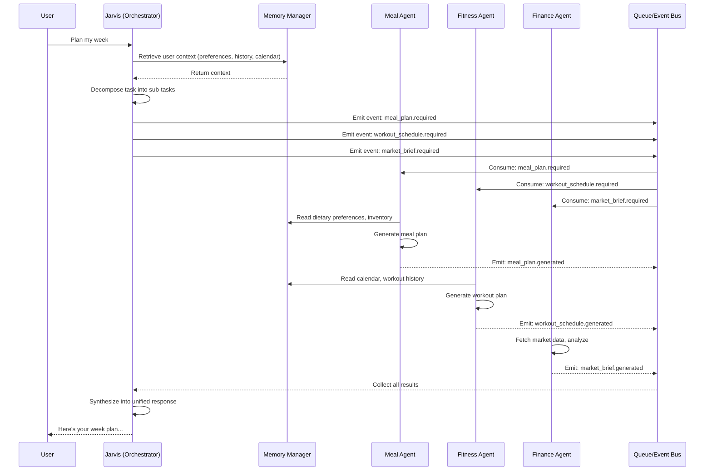
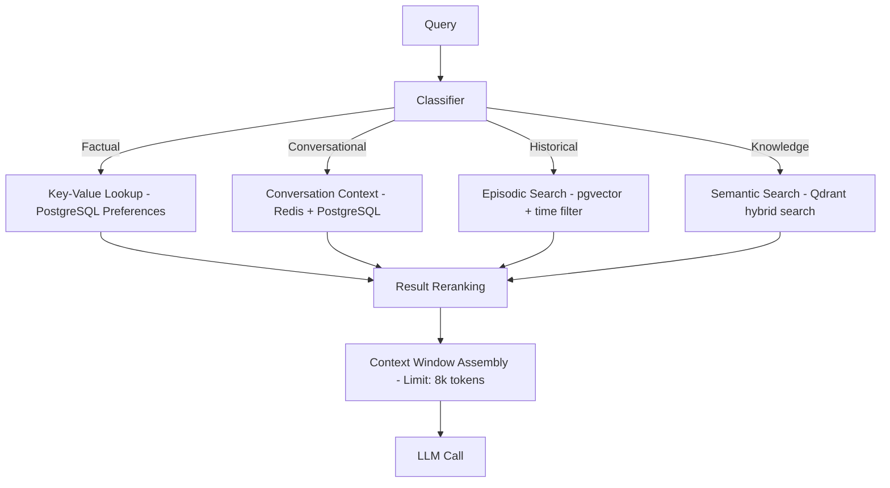
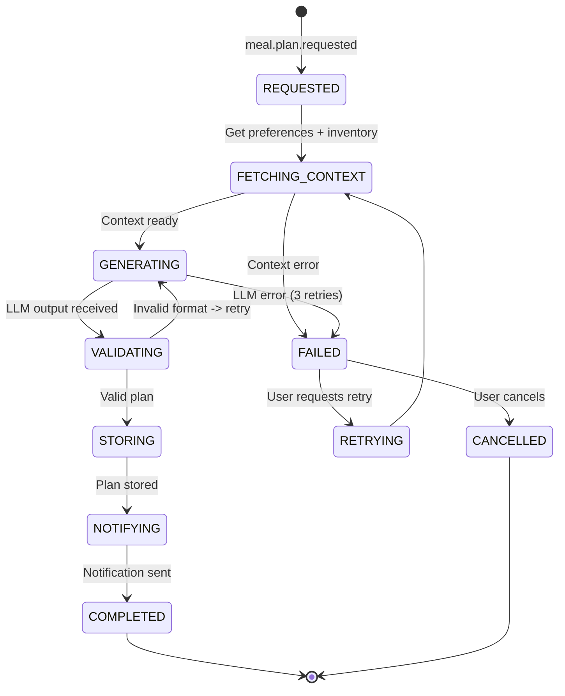
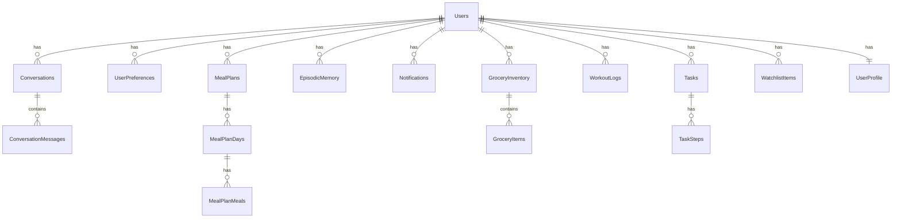

# JARVIS — Personal AI Workforce System
## Complete Technical Blueprint & Implementation Guide

**Version:** 1.0 | **Build Time:** ~30 days to MVP, ~90 days to production

---

# TABLE OF CONTENTS

1. [Project Overview](#1-project-overview)
2. [System Architecture](#2-system-architecture)
3. [Tech Stack Decisions](#3-tech-stack-decisions)
4. [Agent Design](#4-agent-design)
5. [Memory System Design](#5-memory-system-design)
6. [Workflow Orchestration](#6-workflow-orchestration)
7. [Database Design](#7-database-design)
8. [Implementation Roadmap](#8-implementation-roadmap)
9. [Cost Optimization](#9-cost-optimization)
10. [Deployment + DevOps](#10-deployment--devops)
11. [Security + Privacy](#11-security--privacy)
12. [AI Engineering Details](#12-ai-engineering-details)
13. [UI/UX](#13-uiux)
14. [Codebase Structure](#14-codebase-structure)
15. [Example Code](#15-example-code)
16. [Final Recommendation](#16-final-recommendation)

---

# 1. PROJECT OVERVIEW

## 1.1 What We Are Building

Jarvis is a **multi-agent AI workforce** system — a personal chief of staff that coordinates specialized AI agents to handle meal planning, fitness scheduling, financial analysis, and more. It runs on a single developer's infrastructure at under $20/month.

## 1.2 Core Philosophy

| Principle | Description |
|-----------|-------------|
| **Modular** | Agents are independent services communicating via events |
| **Cost-first** | Every component chosen for near-zero operating cost |
| **Privacy-aware** | User data owned by user, runs on user infrastructure |
| **Solo-buildable** | One engineer can build MVP in 30 days |
| **Evolvable** | Scales from $0/month to $1000/month infrastructure without rewrite |

## 1.3 System Capabilities

| Agent | Primary Function | Key Deliverables |
|-------|-----------------|------------------|
| **Jarvis (Orchestrator)** | CEO/chief of staff | Task routing, memory, scheduling, notifications |
| **Meal Agent** | Nutrition & groceries | Weekly meal plans, grocery lists, inventory tracking |
| **Fitness Agent** | Workout scheduling | Daily workout plans, calendar integration, streak tracking |
| **Finance Agent** | Market intelligence | Daily newsletters, watchlist alerts, portfolio summaries |

---

# 2. SYSTEM ARCHITECTURE

## 2.1 High-Level Architecture



## 2.2 Agent Interaction Diagram



## 2.3 Request Lifecycle

1. **Ingestion**: Request arrives via API, WebSocket, or scheduled trigger
2. **Authentication**: Verify identity via JWT/Supabase session
3. **Classification**: Jarvis classifies intent (e.g., "plan meals" -> Meal Agent)
4. **Context Gathering**: Memory manager pulls relevant history, preferences, state
5. **Task Decomposition**: Large tasks broken into subtasks (LangGraph planning step)
6. **Agent Dispatch**: Tasks sent to appropriate agents via event bus or direct call
7. **Execution**: Agent processes with tool calls, may emit sub-events
8. **Result Aggregation**: Jarvis collects all sub-results
9. **Synthesis**: Combined into coherent response
10. **Memory Update**: Key facts extracted and stored
11. **Delivery**: Response sent back + notifications as needed

## 2.4 Synchronous vs Asynchronous

| Type | When | Example | Mechanism |
|------|------|---------|-----------|
| **Sync** | Instant response needed | "What's my next workout?" | Direct API call to agent |
| **Async** | Long-running tasks | "Generate this week's meal plan" | Event -> Queue -> Agent -> Callback |
| **Scheduled** | Time-based | "Send daily market brief at 8 AM" | Celery Beat -> Task |
| **Event-driven** | State changes | "Grocery low -> notify user" | Event Bus -> Consumer |

---

# 3. TECH STACK DECISIONS

## 3.1 Complete Stack Comparison

### LLM Providers

| Provider | Best For | Cheapest Option | Cost (Input/1M tokens) | Tradeoffs |
|----------|----------|-----------------|----------------------|-----------|
| **OpenAI GPT-4o** | Complex reasoning | GPT-4o-mini | $0.15 / $0.60 | Best quality, vendor lock |
| **Anthropic Claude 3.5** | Long context, code | Claude 3 Haiku | $0.25 / $1.25 | Excellent for memory tasks |
| **Gemini 2.0 Flash** | Speed, cost | Gemini 1.5 Flash | $0.075 / $0.30 | Free tier available |
| **Mistral** | Open-source, self-host | Mistral 7B | Free (self-host) | Requires GPU |
| **Llama 3.2** | Self-hosted, privacy | 8B quantized | Free | Needs 8GB+ VRAM |
| **DeepSeek V3** | Cheap API | DeepSeek V3 | $0.27 / $1.10 | Chinese hosted |
| **Groq** | Ultra-low latency | Llama 3.1 8B | Free tier | Rate limited |

**Recommendation:** Start with **GPT-4o-mini** for orchestration (best reasoning/$) and **Gemini 1.5 Flash** for high-volume tasks (cheapest quality API). Add self-hosted **Llama 3.2** later for privacy-sensitive data.

### Vector Databases

| Database | Best For | Cheapest | Storage | Tradeoffs |
|----------|----------|----------|---------|-----------|
| **Qdrant** | Production vector search | Self-hosted Docker | $0 | Best performance, easy self-host |
| **ChromaDB** | Quick prototyping | Embedded | $0 | Not production-ready |
| **Pinecone** | Serverless, zero-ops | Free tier (100k vectors) | $0 | Vendor lock, expensive at scale |
| **Supabase pgvector** | All-in-one DB | With Supabase plan | $0 | Good enough for MVP |

**Recommendation:** **Qdrant** self-hosted with Docker. If using Supabase for everything, use **pgvector** to reduce services.

### Databases

| Database | Best For | Cheapest | Tradeoffs |
|----------|----------|----------|-----------|
| **PostgreSQL** | All structured data | Supabase free tier | The right choice for almost everything |
| **Supabase** | Backend-as-a-service | $0/month | Vendor lock, but good value |
| **SQLite** | Local/dev only | $0 | Not for production multi-service |
| **Redis** | Caching, queues, sessions | $0 self-hosted | RAM expensive at scale |

**Recommendation:** **Supabase** (PostgreSQL + Auth + Storage) as backbone. **Redis** for cache/queue/events. **Qdrant** for vectors.

### Agent Frameworks

| Framework | Best For | Complexity | Tradeoffs |
|-----------|----------|------------|-----------|
| **LangGraph** | Complex agent orchestration | Medium | Steep learning, powerful |
| **CrewAI** | Simple multi-agent | Low | Less control, opinionated |
| **AutoGen** | Conversation between agents | Medium | Microsoft ecosystem |
| **OpenAI Agents SDK** | OpenAI-only agents | Low | Vendor lock-in |
| **PydanticAI** | Type-safe agents | Low | Newer, less ecosystem |
| **Temporal** | Durable execution | High | Overkill for MVP |

**Recommendation:** **LangGraph** for Jarvis orchestrator. **PydanticAI** for sub-agents (type-safe, simple, Pythonic).

### Backend Frameworks

| Framework | Best For | Tradeoffs |
|-----------|----------|-----------|
| **FastAPI** | Async Python API | Best choice -- async, Pydantic, auto-docs |
| **Django** | Full-featured | Overkill, heavy |
| **Flask** | Simple APIs | Not async, outdated patterns |

**Recommendation:** **FastAPI** -- async, native Pydantic, automatic OpenAPI docs.

### Frontend

| Framework | Best For | Tradeoffs |
|-----------|----------|-----------|
| **Next.js 14+** | Full-stack React | Best ecosystem, SSR, App Router |
| **React + Vite** | Lightweight SPA | No SSR |
| **Streamlit** | Quick AI dashboards | Not for production UI |

**Recommendation:** **Next.js 14+** with Tailwind CSS and shadcn/ui.

### Hosting

| Provider | Best For | Cheapest | Tradeoffs |
|----------|----------|----------|-----------|
| **Railway** | Quick deployment | $5/month | Ephemeral storage |
| **Render** | Free tier services | $0/month | Cold starts, limited |
| **Fly.io** | Global edge | ~$2/month | Complex config |
| **Oracle Cloud** | Always free tier | $0/month | 4 ARM cores, 24GB free |
| **Hetzner** | Cheap VPS | ~$4/month | Best $/performance |

**Recommendation:** **Hetzner CX22** (~$4/month) for 24/7 services. Or **Oracle Cloud always-free** (4 ARM cores, 24GB RAM). For true $0: **Render free** + **Cloudflare Workers**.

### CI/CD, Monitoring, Notifications, Scheduling

| Category | Recommendation | Cost |
|----------|---------------|------|
| **CI/CD** | GitHub Actions | $0 (2000 min/month) |
| **Monitoring** | Better Stack + LangSmith | $0 free tiers |
| **Primary Notifications** | Telegram Bot | $0 |
| **Email** | SendGrid free | $0 (100/day) |
| **Scheduling** | APScheduler (MVP) / Celery Beat (prod) | $0 |
| **OCR** | PaddleOCR (self-hosted) | $0 |
| **Financial APIs** | yfinance + nsetools | $0 |

## 3.2 Recommended Final Stack

| Layer | Component | Why | Monthly Cost |
|-------|-----------|-----|-------------|
| **LLM Orchestrator** | GPT-4o-mini | Best reasoning-per-dollar for complex orchestration | ~$3-8 |
| **LLM Sub-agents** | Gemini 1.5 Flash | Cheapest quality API for high-volume tasks | ~$1-3 |
| **LLM Local (optional)** | Llama 3.2 8B via Ollama | Privacy-sensitive data processing | $0 |
| **Backend** | FastAPI | Async, Pydantic, OpenAPI docs | $0 |
| **Database** | Supabase (PostgreSQL) | Auth + DB + Storage in one | $0 |
| **Vector DB** | Qdrant (self-hosted Docker) | Best vector search performance | $0 |
| **Cache/Queue** | Redis (self-hosted Docker) | Multi-purpose infrastructure | $0 |
| **Frontend** | Next.js 14 + Tailwind + shadcn/ui | Modern, responsive, type-safe | $0 |
| **Hosting** | Hetzner CX22 VPS | Best $/performance at ~euro 3.99/mo | ~$4 |
| **CI/CD** | GitHub Actions | Free, well-integrated | $0 |
| **Monitoring** | Better Stack + LangSmith | Free tier for both | $0 |
| **Notifications** | Telegram Bot + SendGrid | Free for both | $0 |
| **Scheduling** | Celery Beat + Redis | Standard Python scheduling | $0 |
| **Embeddings** | text-embedding-3-small | Best quality-per-dollar | ~$0.50 |
| **Financial Data** | yfinance + nsetools | Free, no API keys needed | $0 |
| **OCR** | PaddleOCR (self-hosted) | Free, accurate | $0 |

**Total estimated monthly cost: ~$8-15/month**

---

# 4. AGENT DESIGN

## 4.1 Base Agent Architecture

All agents share a common base structure:

```python
class BaseAgent:
    def __init__(self, agent_id, llm_client, memory_manager, tool_registry):
        self.agent_id = agent_id
        self.llm = llm_client
        self.memory = memory_manager
        self.tools = tool_registry
        self.state = AgentState()

    async def process(self, task: dict) -> dict:
        task_plan = await self._plan(task)
        for step in task_plan.steps:
            result = await self._execute_step(step)
            task_plan.update(step, result)
            if self._should_reflect(task_plan):
                reflection = await self._reflect(task_plan)
                task_plan = self._apply_reflection(task_plan, reflection)
        output = await self._synthesize(task_plan)
        await self.memory.store(self.agent_id, task, output)
        return output

    async def _plan(self, task: dict) -> TaskPlan: ...
    async def _execute_step(self, step: Step) -> StepResult: ...
    async def _reflect(self, plan: TaskPlan) -> Reflection: ...
    async def _synthesize(self, plan: TaskPlan) -> dict: ...
```

## 4.2 Jarvis Orchestrator Agent

### Goals
- Act as CEO/chief of staff for the user
- Coordinate all sub-agents intelligently
- Maintain user context and long-term memory
- Prioritize and schedule tasks

### Responsibilities
- Intent classification and task routing
- Multi-agent coordination
- Memory management delegation
- User preference learning
- Notification and summary generation
- Conflict resolution between agents
- Async workflow management

### Internal Reasoning Loop

```mermaid
graph TD
    A[Receive Input] --> B{Is this a new conversation?}
    B -->|Yes| C[Classify Intent]
    B -->|No| D[Load Conversation Context]
    D --> C
    C --> E{Intent Type}
    E -->|Direct Query| F[Answer from Memory]
    E -->|Agent Task| G[Decompose Task]
    E -->|Scheduling| H[Schedule Task]
    E -->|System Command| I[Execute Command]
    G --> J[Route to Agent(s)]
    J --> K{Need multiple agents?}
    K -->|Yes| L[Parallel Dispatch]
    K -->|No| M[Single Agent Dispatch]
    L --> N[Aggregate Results]
    M --> N
    N --> O[Synthesize Response]
    F --> O
    H --> O
    I --> O
    O --> P[Update Memory]
    P --> Q[Deliver Response]
```

### Prompt Architecture

```
SYSTEM: You are Jarvis, an AI chief of staff. You coordinate specialized agents
to manage the user's life. You are proactive, organized, and efficient.

CORE PRINCIPLES:
1. Understand the user's true intent before acting
2. Delegate to specialized agents when appropriate
3. Maintain context across conversations
4. Proactively suggest helpful actions
5. Be concise and actionable

YOUR CAPABILITIES:
- Route tasks to: Meal Agent, Fitness Agent, Finance Agent
- Manage calendar and schedules
- Send notifications
- Maintain user preferences
- Perform web searches when needed

CURRENT USER CONTEXT: {user_context}
RECENT MEMORY: {recent_memory}
AVAILABLE AGENT STATUS: {agent_status}
CURRENT TIME: {current_time}
UPCOMING SCHEDULE: {schedule}

USER MESSAGE: {user_message}

RESPONSE FORMAT (JSON):
{
    "thought": "Your step-by-step reasoning",
    "intent": "query | delegate | schedule | command",
    "target_agent": null | "meal" | "fitness" | "finance",
    "task": "Description of task for agent",
    "response": "Your response to the user",
    "memory_updates": ["key fact to remember"],
    "notifications": [{"type": "reminder", "message": "...", "time": "..."}]
}
```

### Decision Trees

```
Intent Classification:
- "meal"/"food"/"grocer"/"recipe"/"diet" -> Route to Meal Agent
- "workout"/"exercise"/"fitness"/"gym" -> Route to Fitness Agent
- "market"/"stock"/"finance"/"invest"/"portfolio" -> Route to Finance Agent
- "schedule"/"remind"/"calendar" -> Handle directly (schedule task)
- General Q&A -> Answer from memory + web search
- Greeting -> Respond warmly, suggest actions
```

### Tool Access

| Tool | Description | Agent Access |
|------|-------------|-------------|
| `search_web(query)` | Web search via Tavily | Jarvis, Finance |
| `get_calendar_events(start, end)` | Read calendar | Jarvis, Fitness |
| `create_calendar_event(summary, time)` | Create event | Jarvis, Fitness |
| `send_notification(channel, msg)` | Send alert | All |
| `schedule_task(task, time, recurring)` | Schedule future task | Jarvis |
| `read_memory(key)` | Read from long-term memory | All |
| `write_memory(key, value)` | Write to long-term memory | Jarvis |
| `get_user_preference(key)` | Get preference | All |
| `search_vector(query, collection)` | Semantic search | Jarvis, Finance |
| `execute_agent_function(agent, func, args)` | Direct agent call | Jarvis |

### Retry & Failure Handling

```
Strategy:
- 3 retries with exponential backoff (1s, 4s, 16s)
- Each retry uses different LLM temperature (0.7, 0.5, 0.3)
- After 3 failures: escalate to user with partial results
- System errors (API down): retry with fallback
- Rate limits: queued with jitter, process when available
```

## 4.3 Meal Planner Agent

### Goals
- Optimize weekly nutrition based on preferences
- Minimize food waste and duplicate purchases
- Generate actionable grocery lists

### Responsibilities
- Weekly meal plan generation
- Grocery inventory tracking (manual + OCR)
- Recipe suggestion and rotation
- Budget optimization
- Nutrition tracking

### Tool Access

| Tool | Description |
|------|-------------|
| `get_inventory()` | Current grocery inventory |
| `update_inventory(items)` | Update stock |
| `search_recipes(constraints)` | Recipe database search |
| `get_nutrition_info(food)` | Nutrition lookup |
| `estimate_cost(items)` | Cost estimation |
| `scan_receipt(image)` | OCR receipt parsing |
| `lookup_barcode(code)` | Barcode to product info |

### Prompt Architecture

```
SYSTEM: You are Jarvis's Meal Planning Agent. You create personalized
weekly meal plans based on the user's dietary preferences, available
inventory, nutrition goals, and budget constraints.

USER PREFERENCES: {dietary_restrictions}
CURRENT INVENTORY: {inventory}
RECENT MEALS (avoid repetition): {recent_meals_constraint}

GENERATE: Weekly meal plan with:
1. Breakfast, lunch, dinner for 7 days
2. Grocery list categorized by store section
3. Prep schedule (what to cook when)
4. Estimated total cost
5. Nutrition summary (calories, protein, etc.)
```

## 4.4 Fitness Agent

### Goals
- Maintain consistent workout schedule
- Progressive overload tracking
- Habit formation

### Responsibilities
- Find optimal workout windows in calendar
- Generate personalized workout plans
- Track workout history and progress
- Suggest recovery and rest days
- Streak tracking and motivation

### Tool Access

| Tool | Description |
|------|-------------|
| `get_calendar_availability(start, end)` | Free time slots |
| `get_workout_history(limit)` | Past workouts |
| `generate_workout_plan(constraints)` | Personalized plan |
| `log_workout(details)` | Save completed workout |
| `get_streak_data()` | Current streak info |
| `suggest_recovery()` | Recovery recommendations |

## 4.5 Finance Agent

### Goals
- Provide actionable market intelligence
- Educate the user on market movements
- Monitor watchlists and portfolios

### Responsibilities
- Daily market summary (NSE, BSE, global)
- News aggregation and summarization
- Watchlist monitoring
- Portfolio tracking (manual entry)
- Risk assessment and education

### Tool Access

| Tool | Description |
|------|-------------|
| `get_market_data(symbols)` | Price and volume data |
| `search_financial_news(query)` | News search |
| `get_company_info(symbol)` | Company fundamentals |
| `get_economic_calendar()` | Upcoming economic events |
| `get_currency_rates()` | Forex data |
| `get_index_data(indices)` | Index performance |
| `summarize_article(url)` | AI article summarization |

### Prompt Architecture

```
SYSTEM: You are Jarvis's Finance Agent. You provide educational market
insights and research summaries. You NEVER give financial advice.
All information is for educational purposes only.

IMPORTANT DISCLAIMER IN EVERY NEWSLETTER:
"This is not financial advice. For educational purposes only."

TODAY'S MARKET DATA: {market_data}
WATCHLIST ITEMS: {watchlist}
RECENT NEWS: {news_summaries}
USER'S PORTFOLIO (for context only): {portfolio}

GENERATE: Market brief including:
1. Market overview (indices, sectors)
2. Key movers (gainers, losers)
3. Important news with analysis
4. Watchlist updates
5. Educational insight explaining WHY
```

---

# 5. MEMORY SYSTEM DESIGN

## 5.1 Memory Architecture Overview

```mermaid
graph TB
    subgraph Memory Manager
        MM[MemoryManager - Entry Point]
    end

    subgraph Short-Term (Working)
        CACHE[Redis Cache - TTL: 24h]
        CTX[Conversation Context - Last 50 messages]
    end

    subgraph Long-Term (Episodic)
        EPI[PostgreSQL - episodic_memory]
        EPI_IDX[pgvector Index - episodic_embeddings]
    end

    subgraph Long-Term (Semantic)
        SEM[Qdrant Collection - semantic_knowledge]
    end

    subgraph User Profile
        PREF[PostgreSQL - user_preferences]
        PROF[PostgreSQL - user_profile]
    end

    subgraph Agent State
        STATE[Redis + PostgreSQL - Agent States]
        TASK[PostgreSQL - Task History]
    end

    MM --> CACHE
    MM --> CTX
    MM --> EPI
    MM --> SEM
    MM --> PREF
    MM --> PROF
    MM --> STATE
    MM --> TASK
```

## 5.2 Memory Types

| Type | Storage | TTL | Content | Retrieval Method |
|------|---------|-----|---------|-----------------|
| **Working Memory** | Redis | 24h | Current conversation, active tasks | Key-value lookup |
| **Conversation History** | PostgreSQL + pgvector | Forever | Full conversation text | Time-based + semantic search |
| **Episodic Memory** | PostgreSQL + pgvector | Forever | Past events, interactions, results | Semantic similarity + time range |
| **Semantic Memory** | Qdrant | Forever | Knowledge extracted (facts, preferences, concepts) | Semantic search |
| **User Preferences** | PostgreSQL | Forever | Dietary restrictions, workout preferences, etc. | Direct key-value |
| **Agent State** | Redis + PostgreSQL | Until complete | Current agent processing state | Task ID lookup |
| **Task History** | PostgreSQL | Forever | All completed tasks, outcomes, feedback | Time-based + status |

## 5.3 Retrieval Pipeline



## 5.4 Embedding Strategy

| Aspect | Decision |
|--------|----------|
| **Model** | `text-embedding-3-small` (OpenAI) -- best quality-per-dollar |
| **Dimensions** | 512 (reduced from 1536 for cost/storage efficiency) |
| **Batch Size** | 20 texts per API call |
| **Caching** | Embeddings cached in Redis by text hash |
| **Chunking** | 512 char chunks with 128 char overlap for long texts |

### Cost Optimization

```python
text-embedding-3-small cost: $0.02/1M tokens
Average embedding: ~50 tokens
Cost per embedding: ~$0.000001
Monthly embeddings estimate: ~50,000 -> $0.05/month
```

## 5.5 Memory Pruning & Summarization

### Automatic Pruning

| Trigger | Action |
|---------|--------|
| Conversation > 50 messages | Summarize oldest 25 into a summary, store summary |
| Episodic memory > 1000 entries | Cluster similar entries, keep centroid + summary |
| Semantic memory duplicate found | Merge, keep most recent |
| Redis cache TTL expired | Automatic eviction |
| Grocery inventory item not touched in 30 days | Flag for removal |

### Summarization Strategy

```
When to summarize:
1. End of conversation session
2. Daily at midnight (summarize day's events)
3. Weekly (summarize week for long-term memory)

Summarization prompt:
"Condense the following into a concise paragraph
that preserves all key facts, decisions, and preferences: {text}"

Storage: summary stored in PostgreSQL episodic_memory
with type='summary' and embedding in Qdrant for retrieval
```

---

# 6. WORKFLOW ORCHESTRATION

## 6.1 Event Definitions

```python
EVENTS = {
    # User Events
    "user.message": "New user message received",
    "user.command": "User issued a command",

    # Meal Events
    "meal.plan.requested": "Generate weekly meal plan",
    "meal.plan.generated": "Meal plan ready",
    "meal.inventory.low": "Grocery item running low",
    "meal.grocery.list.updated": "Grocery list changed",
    "meal.receipt.scanned": "Receipt OCR completed",

    # Fitness Events
    "fitness.workout.requested": "Generate workout plan",
    "fitness.workout.scheduled": "Workout scheduled in calendar",
    "fitness.workout.completed": "Workout logged as done",
    "fitness.workout.missed": "Workout not completed",
    "fitness.reminder.due": "Time for workout reminder",

    # Finance Events
    "finance.brief.requested": "Generate market brief",
    "finance.brief.generated": "Market brief ready",
    "finance.alert": "Watchlist alert triggered",
    "finance.news.available": "New relevant financial news",

    # System Events
    "system.daily.digest": "Daily summary trigger",
    "system.weekly.digest": "Weekly summary trigger",
    "system.error": "System error occurred",

    # Notification Events
    "notify.send": "Send notification to user",
    "notify.sent": "Notification delivered",

    # Memory Events
    "memory.store": "Store item in long-term memory",
    "memory.prune": "Trigger memory pruning",
    "memory.summarize": "Trigger memory summarization",
}
```

## 6.2 Queue Architecture

```python
QUEUES = {
    "high_priority": {
        "description": "User-facing requests (need fast response)",
        "consumers": ["jarvis"],
        "retry": 3,
        "ttl": 300,
        "rate_limit": "10/s",
    },
    "agent_tasks": {
        "description": "Agent processing tasks",
        "consumers": ["meal_agent", "fitness_agent", "finance_agent"],
        "retry": 3,
        "ttl": 600,
        "rate_limit": "5/s",
    },
    "notifications": {
        "description": "Notification delivery",
        "consumers": ["notification_service"],
        "retry": 5,
        "ttl": 3600,
        "rate_limit": "20/s",
    },
    "background": {
        "description": "Non-urgent processing (OCR, indexing, pruning)",
        "consumers": ["background_worker"],
        "retry": 2,
        "ttl": 86400,
        "rate_limit": "1/s",
    },
}
```

## 6.3 Retry Architecture

```
                    +-----------+
                    |   Task    |
                    |   Fails   |
                    +-----+-----+
                          |
                +---------v----------+
                | Retry 1 (1s)       |
                | Temp: 0.7          |
                +---------+----------+
                          |
                +---------v----------+
                | Retry 2 (4s)       |
                | Temp: 0.5          |
                +---------+----------+
                          |
                +---------v----------+
                | Retry 3 (16s)      |
                | Temp: 0.3          |
                +---------+----------+
                          |
                +---------v----------+
                | Dead Letter Queue   |
                | (Manual retry       |
                |  or alert)          |
                +--------------------+
```

## 6.4 Idempotency Strategy

```python
# Every event carries a unique idempotency key
EVENT_PAYLOAD = {
    "id": "event_uuid_v7",
    "type": "meal.plan.requested",
    "idempotency_key": "sha256(user_id + date + event_type)",
    "timestamp": "2026-05-09T08:00:00Z",
    "payload": {...},
}

# Before processing:
# 1. Check Redis: EXISTS idempotency_key -> skip if already processed
# 2. SET idempotency_key with 24h TTL
# 3. Process
# 4. On completion: update status to 'completed'
```

## 6.5 Workflow State Machine



---

# 7. DATABASE DESIGN

## 7.1 Entity Relationship Diagram



## 7.2 PostgreSQL Schema (Key Tables)

```sql
-- Enable extensions
CREATE EXTENSION IF NOT EXISTS "uuid-ossp";
CREATE EXTENSION IF NOT EXISTS "vector";

-- Users
CREATE TABLE users (
    id UUID PRIMARY KEY DEFAULT uuid_generate_v4(),
    clerk_id TEXT UNIQUE,
    email TEXT UNIQUE NOT NULL,
    created_at TIMESTAMPTZ DEFAULT NOW(),
    updated_at TIMESTAMPTZ DEFAULT NOW()
);

-- User Profile
CREATE TABLE user_profiles (
    user_id UUID PRIMARY KEY REFERENCES users(id) ON DELETE CASCADE,
    display_name TEXT,
    timezone TEXT DEFAULT 'UTC',
    phone TEXT,
    notification_preferences JSONB DEFAULT '{"telegram": true, "email": false, "whatsapp": false}',
    created_at TIMESTAMPTZ DEFAULT NOW(),
    updated_at TIMESTAMPTZ DEFAULT NOW()
);

-- User Preferences
CREATE TABLE user_preferences (
    id UUID PRIMARY KEY DEFAULT uuid_generate_v4(),
    user_id UUID NOT NULL REFERENCES users(id) ON DELETE CASCADE,
    category TEXT NOT NULL,
    key TEXT NOT NULL,
    value JSONB NOT NULL,
    created_at TIMESTAMPTZ DEFAULT NOW(),
    updated_at TIMESTAMPTZ DEFAULT NOW(),
    UNIQUE(user_id, category, key)
);

-- Conversations
CREATE TABLE conversations (
    id UUID PRIMARY KEY DEFAULT uuid_generate_v4(),
    user_id UUID NOT NULL REFERENCES users(id) ON DELETE CASCADE,
    title TEXT,
    status TEXT DEFAULT 'active',
    message_count INT DEFAULT 0,
    created_at TIMESTAMPTZ DEFAULT NOW(),
    updated_at TIMESTAMPTZ DEFAULT NOW()
);

-- Conversation Messages
CREATE TABLE conversation_messages (
    id UUID PRIMARY KEY DEFAULT uuid_generate_v4(),
    conversation_id UUID NOT NULL REFERENCES conversations(id) ON DELETE CASCADE,
    role TEXT NOT NULL CHECK (role IN ('user', 'assistant', 'system', 'tool')),
    content TEXT NOT NULL,
    metadata JSONB,
    token_count INT DEFAULT 0,
    created_at TIMESTAMPTZ DEFAULT NOW()
);

-- Episodic Memory (with pgvector)
CREATE TABLE episodic_memory (
    id UUID PRIMARY KEY DEFAULT uuid_generate_v4(),
    user_id UUID NOT NULL REFERENCES users(id) ON DELETE CASCADE,
    type TEXT NOT NULL,
    content TEXT NOT NULL,
    summary TEXT,
    embedding VECTOR(512),
    metadata JSONB DEFAULT '{}',
    importance_score FLOAT DEFAULT 0.5,
    created_at TIMESTAMPTZ DEFAULT NOW()
);
CREATE INDEX idx_episodic_embedding ON episodic_memory
    USING ivfflat (embedding vector_cosine_ops) WITH (lists = 100);

-- Tasks
CREATE TABLE tasks (
    id UUID PRIMARY KEY DEFAULT uuid_generate_v4(),
    user_id UUID NOT NULL REFERENCES users(id) ON DELETE CASCADE,
    parent_task_id UUID REFERENCES tasks(id),
    agent_type TEXT NOT NULL,
    event_type TEXT NOT NULL,
    status TEXT NOT NULL DEFAULT 'pending'
        CHECK (status IN ('pending', 'processing', 'completed', 'failed', 'cancelled')),
    input_payload JSONB,
    output_payload JSONB,
    error_info JSONB,
    retry_count INT DEFAULT 0,
    token_usage INT DEFAULT 0,
    cost_usd FLOAT DEFAULT 0,
    created_at TIMESTAMPTZ DEFAULT NOW(),
    started_at TIMESTAMPTZ,
    completed_at TIMESTAMPTZ
);

-- Grocery Items
CREATE TABLE grocery_items (
    id UUID PRIMARY KEY DEFAULT uuid_generate_v4(),
    inventory_id UUID NOT NULL REFERENCES grocery_inventory(id) ON DELETE CASCADE,
    name TEXT NOT NULL,
    category TEXT,
    quantity FLOAT NOT NULL DEFAULT 1,
    unit TEXT DEFAULT 'unit',
    estimated_price FLOAT,
    expiry_date DATE,
    status TEXT DEFAULT 'in_stock' CHECK (status IN ('in_stock', 'low', 'expired', 'consumed')),
    created_at TIMESTAMPTZ DEFAULT NOW(),
    updated_at TIMESTAMPTZ DEFAULT NOW()
);

-- Workout Logs
CREATE TABLE workout_logs (
    id UUID PRIMARY KEY DEFAULT uuid_generate_v4(),
    user_id UUID NOT NULL REFERENCES users(id) ON DELETE CASCADE,
    workout_date DATE NOT NULL,
    workout_type TEXT NOT NULL,
    duration_minutes INT,
    exercises JSONB,
    metrics JSONB,
    perceived_difficulty TEXT,
    notes TEXT,
    created_at TIMESTAMPTZ DEFAULT NOW(),
    UNIQUE(user_id, workout_date)
);

-- Watchlist
CREATE TABLE watchlist_items (
    id UUID PRIMARY KEY DEFAULT uuid_generate_v4(),
    user_id UUID NOT NULL REFERENCES users(id) ON DELETE CASCADE,
    symbol TEXT NOT NULL,
    exchange TEXT DEFAULT 'NSE',
    asset_type TEXT DEFAULT 'stock',
    target_price FLOAT,
    alert_threshold_percent FLOAT DEFAULT 5.0,
    created_at TIMESTAMPTZ DEFAULT NOW(),
    updated_at TIMESTAMPTZ DEFAULT NOW(),
    UNIQUE(user_id, symbol, exchange)
);

-- Notifications
CREATE TABLE notifications (
    id UUID PRIMARY KEY DEFAULT uuid_generate_v4(),
    user_id UUID NOT NULL REFERENCES users(id) ON DELETE CASCADE,
    channel TEXT NOT NULL CHECK (channel IN ('telegram', 'email', 'whatsapp', 'push', 'in_app')),
    title TEXT,
    body TEXT NOT NULL,
    metadata JSONB,
    status TEXT DEFAULT 'pending'
        CHECK (status IN ('pending', 'sent', 'delivered', 'failed', 'read')),
    scheduled_at TIMESTAMPTZ,
    sent_at TIMESTAMPTZ,
    read_at TIMESTAMPTZ,
    created_at TIMESTAMPTZ DEFAULT NOW()
);

-- Agent Logs
CREATE TABLE agent_logs (
    id UUID PRIMARY KEY DEFAULT uuid_generate_v4(),
    task_id UUID REFERENCES tasks(id),
    agent_type TEXT NOT NULL,
    log_level TEXT NOT NULL DEFAULT 'info',
    message TEXT NOT NULL,
    metadata JSONB,
    token_usage INT,
    created_at TIMESTAMPTZ DEFAULT NOW()
);
```

## 7.3 Backup Strategy

```bash
# Daily database backup
0 2 * * * pg_dump -U postgres jarvis > /backups/jarvis_$(date +%Y%m%d).sql

# Weekly encrypted backup to cloud (rclone to Backblaze B2 or S3)
0 3 * * 0 gzip /backups/jarvis_$(date +%Y%m%d).sql && rclone copy /backups/jarvis_*.gz b2:jarvis-backups/

# Retention: 7 daily, 4 weekly, 12 monthly
```

---

# 8. IMPLEMENTATION ROADMAP

## 8.1 MVP Phase (Days 1-30)

### Goal
Working system with core chat interface, Jarvis orchestrator, and 2 agents functioning end-to-end.

### Features
- FastAPI backend with LangGraph integration
- Jarvis orchestrator with intent classification
- Meal Agent: basic weekly meal plan generation
- Fitness Agent: basic workout scheduling
- Telegram bot as primary interface
- PostgreSQL with Supabase
- Redis for queue + cache
- Basic memory (conversation history + user preferences)
- Docker Compose for local dev
- Deployment to single VPS

### Not in MVP
- Finance Agent
- OCR/grocery inventory
- Web dashboard
- Voice/mobile
- Knowledge graphs
- Advanced memory systems

### Timeline

| Day | Focus | Deliverables |
|-----|-------|-------------|
| 1-2 | Project setup | Repo structure, Docker Compose, CI/CD |
| 3-5 | Backend foundation | FastAPI app, Supabase integration, auth |
| 6-8 | Database setup | Schema migration, models, repositories |
| 9-11 | LLM integration | OpenAI/Gemini clients, LangGraph setup |
| 12-14 | Jarvis core | Intent classification, task routing, memory |
| 15-17 | Meal Agent | Meal plan generation, preference integration |
| 18-20 | Fitness Agent | Workout scheduling, calendar integration |
| 21-23 | Telegram bot | Bot setup, message handling, notifications |
| 24-26 | Integration testing | End-to-end workflows, error handling |
| 27-28 | Deployment | VPS setup, Docker, domain, HTTPS |
| 29-30 | MVP polish | Bug fixes, cost optimization, documentation |

## 8.2 V1 Phase (Days 31-60)

### Additions
- Finance Agent with market data + newsletter
- Qdrant vector database
- Episodic + semantic memory
- Web dashboard (Next.js)
- Email notifications (daily briefs)
- Grocery inventory management
- OCR for receipt scanning
- Scheduled workflows (Celery Beat)
- Monitoring (Better Stack + LangSmith)
- WhatsApp integration

### Timeline

| Week | Focus |
|------|-------|
| Week 5 | Finance Agent (market data, watchlists) |
| Week 6 | Qdrant + vector memory pipeline |
| Week 7 | Next.js web dashboard |
| Week 8 | Notifications, scheduling, monitoring |

## 8.3 V2 Phase (Days 61-90)

### Additions
- OCR integration (PaddleOCR for bills)
- Barcode scanning support
- Advanced memory (pruning, summarization)
- Voice assistant (speech-to-text)
- Mobile-responsive web UI
- Knowledge graph
- Agent evaluation framework
- Multi-model routing (cheap vs expensive)
- Cost analytics dashboard

### Timeline

| Week | Focus |
|------|-------|
| Week 9 | OCR pipeline + inventory automation |
| Week 10 | Memory optimization (pruning, summarization, RAG) |
| Week 11 | Voice + mobile UI improvements |
| Week 12 | Evaluation, monitoring, cost optimization |

## 8.4 What NOT to Overengineer

1. **Don't build a web UI for MVP** -- Telegram bot is enough
2. **Don't implement complex RAG initially** -- Simple prefix search works for small data
3. **Don't over-engineer the agent framework** -- Start with direct function calls, add LangGraph later
4. **Don't optimize for scale** -- PostgreSQL handles millions of rows; you won't have that
5. **Don't build your own queue** -- Redis lists are fine for this load
6. **Don't implement multi-tenancy** -- This is a personal system
7. **Don't build a fancy frontend** -- Focus on backend AI logic
8. **Don't implement complex caching** -- Redis with simple TTL is sufficient

## 8.5 Biggest Mistakes to Avoid

1. **Using expensive LLM for everything** -- Route simple tasks to cheap models
2. **Not caching LLM responses** -- Cache identical or similar queries
3. **Too many microservices** -- Start as a monolith, extract when needed
4. **Over-designing the agent framework** -- Agents are just functions with LLM calls
5. **Ignoring token costs** -- Monitor token usage from day one
6. **Building vs buying** -- Use Supabase, don't build auth yourself
7. **Premature optimization** -- Don't optimize queries until you have data
8. **No logging** -- You need logs to debug agent behavior
9. **Skipping tests** -- Agent outputs should be tested for structure/validity
10. **Not setting up monitoring early** -- You need to know when costs spike or agents fail
